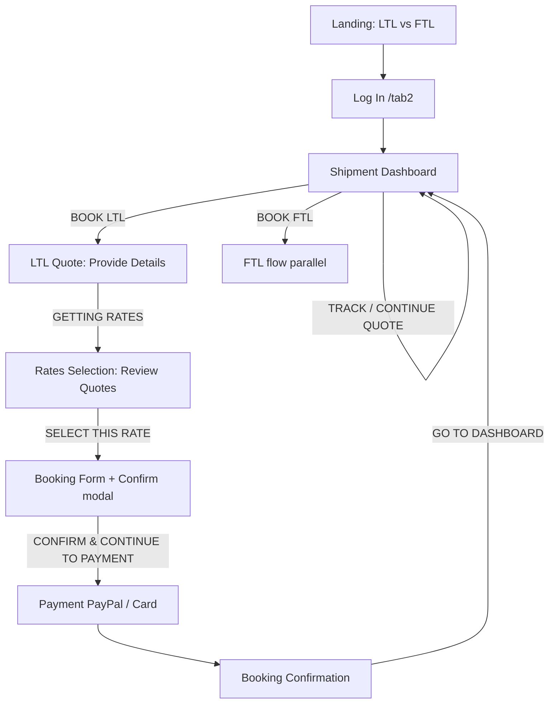

# Lomont Vista — product workflow & UI map

**Purpose:** Persistent agent knowledge for Lomont Vista (separate from MediTap). Captured from live UI (2026-08-03) + VM diagnostics so future modifications have the full flow and element inventory.

**Tracking:** Jira `LV-*` on Atlassian — not the MediTap `MT-AG-###` register unless the user asks to mirror items.

**Live site:** [https://www.lomontvista.com](https://www.lomontvista.com) · Landing: `/lomontlanding`

**VM:** `trading_bot@lomonvista` · Source: `~/LV` (`https://github.com/amarquez809hg/LV.git`) · Brand line: “Powered by Ninsker’s”

---

## Runtime architecture (confirmed)

```text
Browser
  │
  ├─ Static SPA (landing, tabs, assets)
  │     nginx :80/:443  →  /var/www/lomontvista
  │
  └─ API / auth / quotes / bookings
        nginx location /api/  →  proxy_pass http://127.0.0.1:8000
              │
              Docker lv_web_1  (Django, image lv_web)
              Docker lv_db_1   (postgres:15)
```

| Piece | Location | Notes |
|--------|----------|--------|
| Frontend build (served) | `/var/www/lomontvista` | Static `index.html` + `assets/` |
| Backend source | `~/LV` + `LomontVistaWebApp/` | Django app; compose in `~/LV` |
| API listen | `0.0.0.0:8000` | Via `docker-proxy` when containers are up |
| Auth login API | `POST /api/auth/login/` | Bad gateway when `lv_web_1` is down |
| Profile | `GET /api/auth/profile/` | Used after session |
| Quotes list | `GET /api/quote-requests/` | Dashboard data |

### Ops note (session outage 2026-08-03)

- Both containers were **Exited ~2 weeks**; nginx stayed up → login showed “sign-in server … bad gateway”.
- `lv_web_1` exit **137** = SIGKILL (often OOM or host reboot kill).
- Host reboot **2026-08-01**; stack did **not** auto-restart.
- Fix: `cd ~/LV && docker-compose up -d` (start DB then web).
- Disk ~76% free 2.3G; RAM OK when idle. Prefer `restart: unless-stopped` later so reboot does not break login again.

---

## High-level user journey



---

## 1. Landing (mode choice)

**Elements**

- Brand: Lomont Vista logo (mountain/arch) + wordmark
- Choice card split: **LTL** (Less Than Truckload) | **FTL** (Full Truckload)
- Footer credit: “POWERED BY NINSKER’S”
- Header: Dashboard (when signed in)
- Floating **Support** (headset) — present on almost every screen

---

## 2. Authentication

**Route cue:** login referrer `/tab2`; post-login app uses `/tab1` (dashboard).

**Log In screen**

| Element | Detail |
|---------|--------|
| Title | Welcome Back |
| Google SSO | Continue with Google |
| Email / password | Fields + show-password eye |
| Remember device | Checkbox: store email/password on private device only |
| Primary CTA | Log In (gold) |
| Links | Forgot password? · New here? Create an account |
| Error (when API down) | Red alert: sign-in server temporarily unavailable (bad gateway) |
| Nav | ← Back to Home |

**Session chrome (authenticated)**

- Gold **LOGOUT** on most pages
- Customer code seen in bookings: **`LVAdminMarq`** (admin/test account pattern)

---

## 3. Shipment Dashboard

**Title:** Shipment Dashboard · Search: “Search by ID, City, Status…”

### Status filter tabs

`All` · `Rated` · `Booked` · `Pending` · `In Transit` · `Delivered` · `Cancelled` · `Archive`

### Primary actions

- **+ BOOK LTL** (gold/brown)
- **+ BOOK FTL** (purple)

### Shipment list card

| Field / control | Example / notes |
|-----------------|-----------------|
| Mode badge | LTL (gold) or FTL (purple) |
| Status badge | BOOKED, PENDING, … |
| Quote/booking ID | `210-20260709`, `212-20260803` (pattern `NNN-YYYYMMDD`) |
| Route | `Albuquerque, NM → Providence, RI` |
| Submitted | Date with calendar icon |
| Actions | **TRACK** (booked) or **CONTINUE QUOTE** (pending) |

### Detail side panel (“LATEST QUOTE …”)

- Status bar (e.g. BOOKED)
- Route, cargo (`1.00 PLTS, 400 LBS`), submitted date
- **BOL / PRO** (highlighted), e.g. `BG1183126326`, `BG1198205326`
- CTA: **Track This Shipment**

List count example after new book: “Showing All Shipments (21)” → “(22)”.

---

## 4. LTL booking workflow (4 steps)

Progress stepper (all screens after quote start):

1. **Provide Details**
2. **Review Quotes**
3. **Book Shipment**
4. **Confirmation Details**

Shared chrome: ← Dashboard · logo · LOGOUT · Support FAB.

### Step 1 — Provide Details (`LTL Shipment Quote`)

**Hero:** “LTL Shipment Quote” / “Less-than-Truckload (LTL) freight services”

**Origin / destination**

- Origin ZIP, Destination ZIP (swap control between them)
- Pickup date (calendar), e.g. `08/03/2026`

**Item 1 (freight line)**

- # of Units, Unit Type (e.g. Pallets)
- Weight (lbs), Length / Width / Height (IN)
- Density (derived/shown)
- Description later on confirmation: “General freight - palletized shipment”

**Accessorials**

- Shipment / Pickup / Delivery accessorial dropdowns

**References (optional)**

- PO / customer ref / sales order style fields
- + ADD ANOTHER REFERENCE NUMBER
- CLEAR FORM & START FRESH

**Rate fetch UI**

- Bar: **GETTING RATES FROM CARRIERS…**
- Info: “Finding Best Rates…” (may take up to a minute)

**Sample payload used in capture**

| Field | Value |
|-------|--------|
| Origin | Albuquerque, NM (87102 area) |
| Destination | Providence, RI (02903 area) |
| Units | 1 PLTS |
| Weight | 400 lbs |
| Dims | 45×42×45 IN |
| Linear footage (later) | 3.75 ft |
| Mode | LTL |

### Step 2 — Review Quotes (`Rates Selection`)

**Hero:** Select Shipping Rate · request id e.g. **QR-212**

**Summary strip:** FROM / TO / CARGO / MODE

**Available Shipping Rates** — badge e.g. “18 carriers”; grid vs list toggle.

**Rate card elements**

| Element | Examples |
|---------|----------|
| Tag | Budget Buy · Fastest · Want It · Need It |
| Carrier | TForce Freight, XPO Logistics, ABF Freight System, Central Transport, Estes, FedEx Freight Economy/Priority, … |
| SCAC | UPGF, CNWY, ABFS, CTII, EXLA, FXNL, FXFE, … |
| Price | e.g. $375.70 |
| Transit | e.g. 5 days · “by Aug 10, 2026” |
| Service | STANDARD, GUARANTEE BY 5PM, GUARANTEED BY AM (NOON) |
| CTA | SELECT THIS RATE (selected card highlighted) |

**Captured selection:** TForce Freight · Standard LTL · 5 days · **$375.70** · SCAC UPGF · tag Budget Buy.

### Step 3 — Book Shipment (`Booking Form`)

**Hero:** Book Shipment / “Complete your booking details.”

**Shipment protection**

- Yes, protect goods / No, don’t protect (insurance → Cost “Insurance: TBD” when No)

**Cost panel**

- Shipping Cost · Insurance · Total (e.g. $375.70 USD)

**Consent**

- Checkbox: agree to Terms & Conditions + accuracy of information

**Actions**

- **BOOK SHIPMENT**
- **SAVE FOR LATER**

#### Confirm Your Booking (modal)

- Booking summary + card-memory security checkbox (last 4 + brand only; full PAN never stored)
- Selected carrier block (carrier, service, transit, cost)
- Origin / destination company, address, pickup window
- **Total Cost**
- **CONFIRM & CONTINUE TO PAYMENT**
- PayPal · Debit or Credit Card (“Powered by PayPal”)
- ← GO BACK & EDIT

**Companies in capture:** COMPANY 1 (Hazeldine Ave SE, Albuquerque, NM 87102) → COMPANY 2 (Friendship St, Providence, RI 02903); windows 8:00 AM – 5:00 PM.

### Step 4 — Confirmation Details (`Booking Confirmation`)

**Success:** “Booking Confirmed!”

| Field | Example |
|-------|---------|
| Booking reference | **212-20260803** |
| Booked on | 8/3/2026, 12:01:55 PM |
| Customer code | LVAdminMarq |
| Carrier BOL / PRO | BG1198205326 |

**Route Information** — Pickup (green) / Delivery (dark blue) cards with company, address, date/window.

**Shipment Details (Item 1)** — units, weight, dims, description, linear footage, mode, class.

**References** — Lomont Vista customer code.

**Actions**

- DOWNLOAD PDF · SEND TO MY EMAIL · **GO TO DASHBOARD**

**What’s Next**

1. Confirmation PDF emailed  
2. Carrier contacts for pickup  
3. Track from Dashboard  
4. Keep booking reference  

**Site footer (confirmation):** About / Leadership / Carriers · Shippers Overview / Technology / Rewards · Modes Truckload (FTL) / LTL / Managed Transport · social icons · © Lomont Vista Inc.

---

## ID & naming conventions

| Kind | Pattern / examples |
|------|---------------------|
| Quote request UI id | `QR-212` |
| Booking / list id | `212-20260803` (`seq-YYYYMMDD`) |
| BOL / PRO | `BG1198205326` |
| Customer code | `LVAdminMarq` |
| SPA tabs (observed) | `/tab1` dashboard · `/tab2` login · `/lomontlanding` marketing |

---

## Cross-cutting UI kit

- Dark header bars; gold brand accents; Support FAB bottom-right
- Truck hero photography with digital HUD overlays (quote, rates, book, dashboard)
- Gold LOGOUT when authenticated
- Stepper uses gold = done, blue = current, gray = upcoming (rates step)
- Mode colors: LTL gold/brown CTAs; FTL purple CTAs

---

## Admin access (Django + in-app)

| Item | Detail |
|------|--------|
| Django Admin URL | [https://www.lomontvista.com/admin/](https://www.lomontvista.com/admin/) |
| In-app Users | [https://www.lomontvista.com/admin-portal/users](https://www.lomontvista.com/admin-portal/users) |
| In-app Traffic | [https://www.lomontvista.com/admin-portal/traffic](https://www.lomontvista.com/admin-portal/traffic) — anonymous pageviews/sessions |
| Staff API | `GET /api/admin/users/`, `GET /api/admin/traffic/`; beacon `POST /api/analytics/pageview/` |
| Attribution | Landing captures `gclid` / `utm_*` → stored on signup in `UserProfile` |
| Traffic privacy | Random `session_key` + path only — no names/emails/IPs |

---

## Ads (sponsor rail)

| Item | Detail |
|------|--------|
| Status | **Enabled** (2026-08-05) — new creative |
| Sponsor | Farah Law — Personal Injury and Wrongful Death |
| Destination | [https://gflawoffices.com](https://gflawoffices.com) |
| Creative | Skyscraper `409×1024` JPEG |
| Asset | `FELV/public/assets/ads/farah-law-skyscraper.jpg` |
| Component | `FELV/src/components/FarahSkyscraperAd.tsx` (+ `.css`) |
| Mount | **Landing only** — inside `.hero-container` on `/lomontlanding` (not global `App.tsx`) |
| Visibility | Desktop only (`min-width: 1280px`); `position: absolute` in hero (scrolls away); width **130px** |
| Publish | `npm run build` then `./scripts/deploy-static.sh` (`~/.ssh/lomont_gcp`) |

---

## Modification hotspots (for future work)

| Change type | Likely touchpoints |
|-------------|-------------------|
| Auth / session / bad gateway | Docker `lv_web`/`lv_db`, nginx `/api/` proxy, `/api/auth/*` |
| Dashboard filters / cards | Quote-request list API + dashboard SPA |
| Rate shopping | Carrier integrations behind “GETTING RATES…”; rate card tags/pricing |
| Booking + payment | Booking form, confirm modal, PayPal/card flow |
| Confirmation / PDF / email | Confirmation page + download/email endpoints |
| Sponsor ads | `FarahSkyscraperAd` + `public/assets/ads/farah-law-skyscraper.jpg` |
| Deploy frontend | Build FELV → rsync `dist/` to `/var/www/lomontvista` |
| Deploy backend | `~/LV` docker-compose rebuild/up + migrations |

---

## Capture metadata

- **Captured:** 2026-08-03 (post container restart; full LTL path exercised Albuquerque → Providence, TForce $375.70, booking `212-20260803`)
- **Screenshots:** Cursor assets under `~/.cursor/projects/Users-amarquez-Desktop-MediTap/assets/Screenshot_2026-08-03_at_11.*` and `12.*`
- **Update this file** when flows, tabs, APIs, or deploy paths change.

---

*Lomont Vista agent continuity — not part of MediTap product register.*
